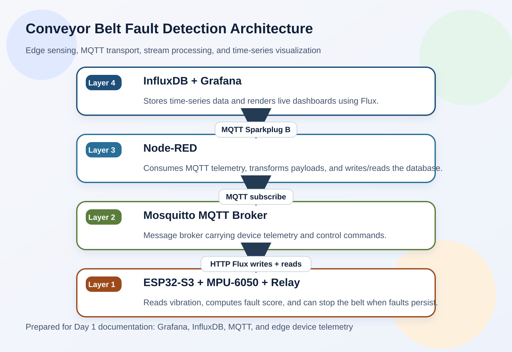

# Conveyor Belt Fault Detection

---

## Team

- e20377, Name, [email](mailto:name@email.com)
- eNumber, Name, [email](mailto:name@email.com)
- eNumber, Name, [email](mailto:name@email.com)

## Table of Contents

1. [Introduction](#introduction)
2. [System Architecture](#system-architecture)
3. [Links](#links)

---

## Introduction

This project implements conveyor belt fault detection using an ESP32-S3, an MPU-6050 vibration sensor, and a relay-based shutdown path. The edge device samples acceleration data, computes a fault score, and publishes structured telemetry over MQTT. A Docker-based stack receives the telemetry, stores it in InfluxDB, and visualizes the live status in Grafana.

The problem being addressed is early detection of belt slip, misalignment, roller faults, and jam conditions on a conveyor line. By combining edge inference with a time-series observability stack, the system can detect abnormal vibration patterns, trigger a protective stop, and keep a history of operating behaviour for later analysis.

## System Architecture

The architecture is split into four layers so sensing, messaging, storage, and visualization stay decoupled:

1. Layer 1: ESP32-S3 plus MPU-6050 and relay. The ESP32 reads raw acceleration values, derives vibration magnitude, classifies faults, and publishes JSON payloads. The relay can stop the conveyor when repeated faults are detected.
2. Layer 2: Mosquitto MQTT broker. This is the message transport layer. The ESP32 publishes Sparkplug-style topics and subscribes to command messages for relay control.
3. Layer 3: Node-RED. This acts as the bridge between MQTT and the analytics stack. It subscribes to device telemetry, can transform payloads if needed, and forwards data toward InfluxDB.
4. Layer 4: InfluxDB plus Grafana. InfluxDB stores the time-series measurements and Grafana queries the bucket using Flux to render live charts and historical trends.

## Links

- [Project Repository](https://github.com/cepdnaclk/e20-co326-Conveyor-Belt-Fault-Detection){:target="_blank"}
- [Project Page](https://cepdnaclk.github.io/e20-co326-Conveyor-Belt-Fault-Detection){:target="_blank"}
- [Department of Computer Engineering](http://www.ce.pdn.ac.lk/)
- [University of Peradeniya](https://eng.pdn.ac.lk/)

[//]: # "Please refer this to learn more about Markdown syntax"
[//]: # "https://github.com/adam-p/markdown-here/wiki/Markdown-Cheatsheet"
